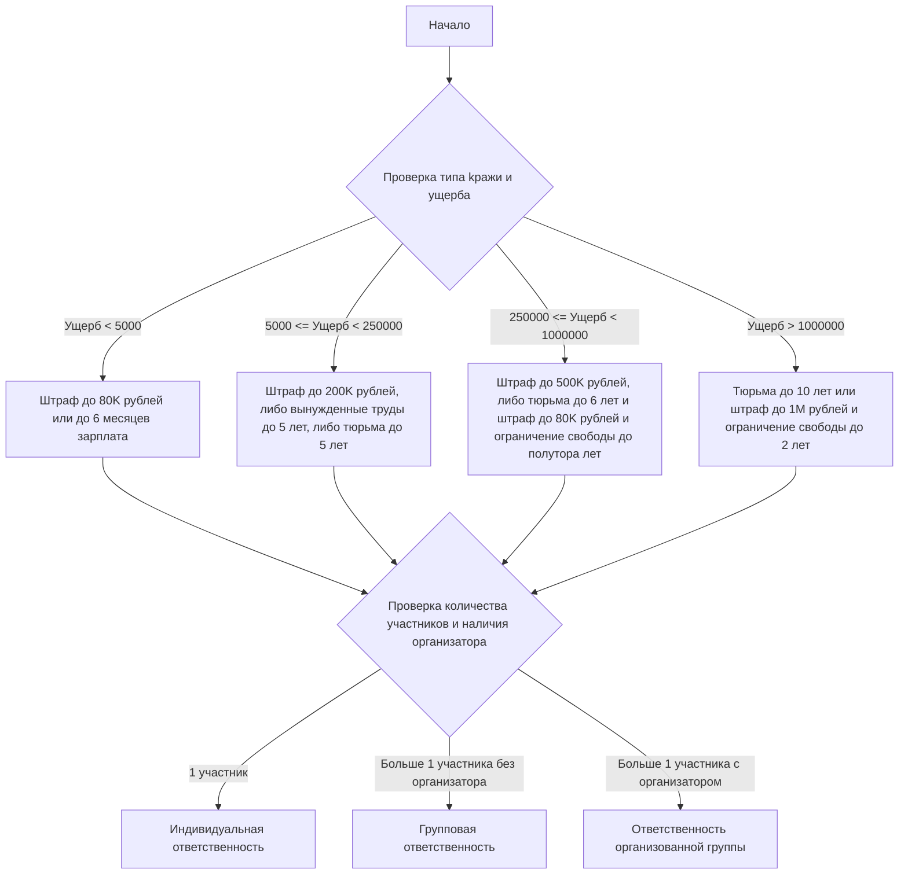

# verdicts-bot

https://t.me/RuVerdictsBot

```mermaid
graph TD;
  A[Начало] --> B{Проверка типа kражи и ущерба}
  B -->|Ущерб < 5000| C[Штраф до 80K рублей или до 6 месяцев зарплата]
  B -->|5000 <= Ущерб < 250000| D[Штраф до 200K рублей, либо вынужденные труды до 5 лет, либо тюрьма до 5 лет]
  B -->|250000 <= Ущерб < 1000000| E[Штраф до 500K рублей, либо тюрьма до 6 лет и штраф до 80K рублей и ограничение свободы до полутора лет]
  B -->|Ущерб > 1000000| F[Тюрьма до 10 лет или штраф до 1M рублей и ограничение свободы до 2 лет]
  C --> G{Проверка количества участников и наличия организатора}
  D --> G
  E --> G
  F --> G
  G -->|1 участник| H[Индивидуальная ответственность]
  G -->|Больше 1 участника без организатора| I[Групповая ответственность]
  G -->|Больше 1 участника c организатором| J[Ответственность организованной группы]
```
